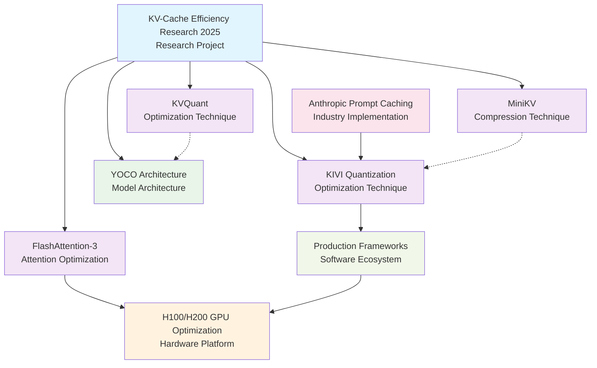
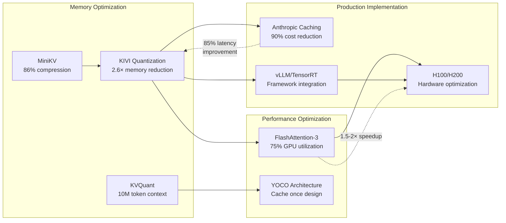
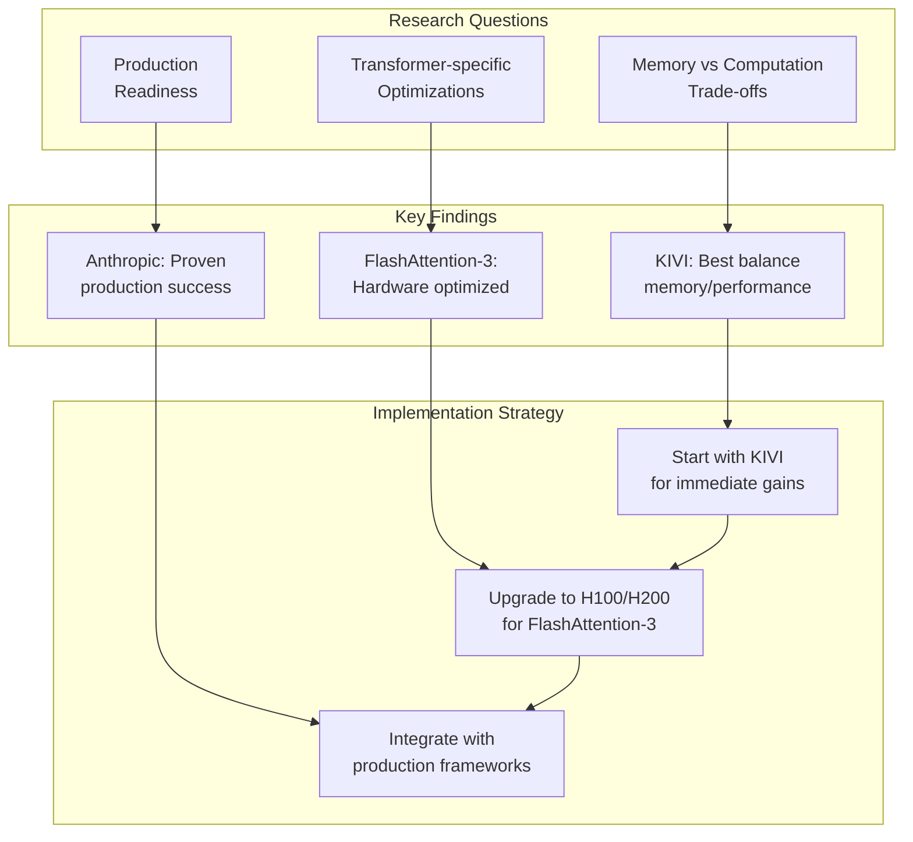
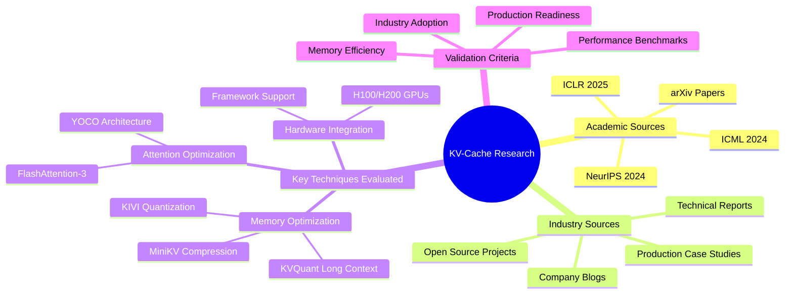

# KV-Cache Efficiency Research Knowledge Graph Visualization

## Main Research Graph



## Detailed Technique Relationships



## Thinking Process Flow



## Performance Impact Analysis

```mermaid
gantt
    title KV-Cache Optimization Impact Timeline
    dateFormat X
    axisFormat %s
    
    section Memory Reduction
    KIVI (2.6×)           :0, 3
    MiniKV (86% compress) :1, 4
    KVQuant (10M tokens)  :2, 5
    
    section Speed Improvement
    FlashAttention-3 (2×) :0, 2
    H100 Optimization     :1, 3
    
    section Cost Reduction
    Anthropic (90%)       :0, 4
    Production Deploy     :2, 5
```



## Architecture Evolution Map

```mermaid
graph LR
    subgraph "Traditional Approach"
        A1[Standard Attention<br/>O(n²) memory]
        A2[Full KV Storage<br/>Linear growth]
        A3[CPU-GPU Transfer<br/>Bottleneck]
    end
    
    subgraph "Current SOTA (2025)"
        B1[FlashAttention-3<br/>Hardware optimized]
        B2[KIVI Quantization<br/>Smart compression]
        B3[YOCO Architecture<br/>Cache once]
    end
    
    subgraph "Implementation Benefits"
        C1[75% GPU Utilization<br/>vs 40% traditional]
        C2[2.6× Memory Reduction<br/>3.47× Throughput]
        C3[90% Cost Reduction<br/>85% Latency Improvement]
    end
    
    A1 --> B1
    A2 --> B2
    A3 --> B3
    
    B1 --> C1
    B2 --> C2
    B3 --> C3
    
    %% Styling
    classDef traditional fill:#ffebee
    classDef current fill:#e8f5e8
    classDef benefits fill:#e3f2fd
    
    class A1,A2,A3 traditional
    class B1,B2,B3 current
    class C1,C2,C3 benefits
```

## Research Methodology Visualization



## Summary

The visualization shows how our KV-cache efficiency research forms a cohesive knowledge graph with clear relationships between:

1. **Research Questions** → **Key Findings** → **Implementation Strategy**
2. **Academic Techniques** → **Industry Adoption** → **Production Benefits**  
3. **Memory Optimization** ← → **Performance Gains** ← → **Cost Reduction**

The thinking process reveals that successful KV-cache optimization requires balancing multiple factors:
- Memory efficiency vs computational overhead
- Academic innovations vs production readiness
- Hardware capabilities vs software implementation
- Short-term gains vs long-term scalability

This structured approach enabled identification of the most impactful techniques (KIVI, FlashAttention-3) and their practical implementation pathways.